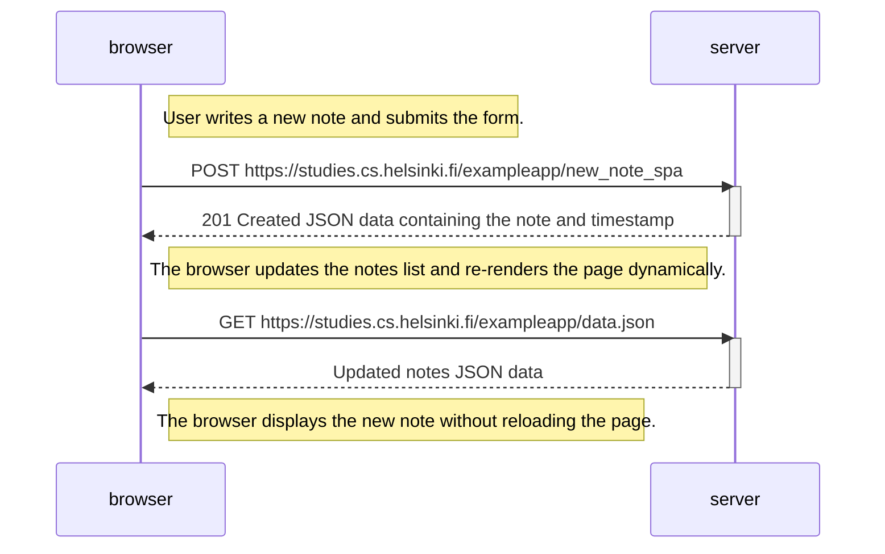

```mermaid
sequenceDiagram
participant browser
participant server

    Note right of browser: User writes a new note and submits the form.

    browser->>server: POST https://studies.cs.helsinki.fi/exampleapp/new_note_spa
    activate server
    server-->>browser: 201 Created JSON data containing the note and timestamp
    deactivate server

    Note right of browser: The browser updates the notes list and re-renders the page dynamically.

    browser->>server: GET https://studies.cs.helsinki.fi/exampleapp/data.json
    activate server
    server-->>browser: Updated notes JSON data
    deactivate server

    Note right of browser: The browser displays the new note without reloading the page.
```
